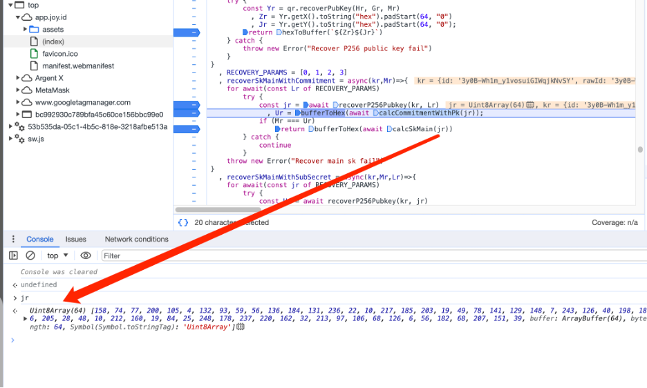
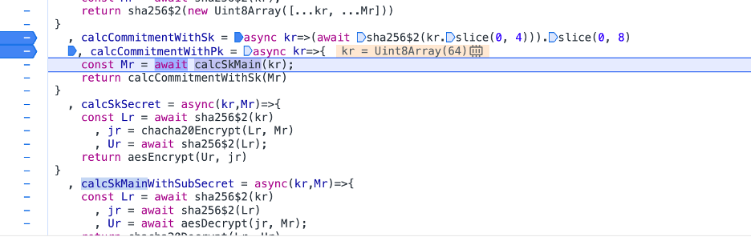
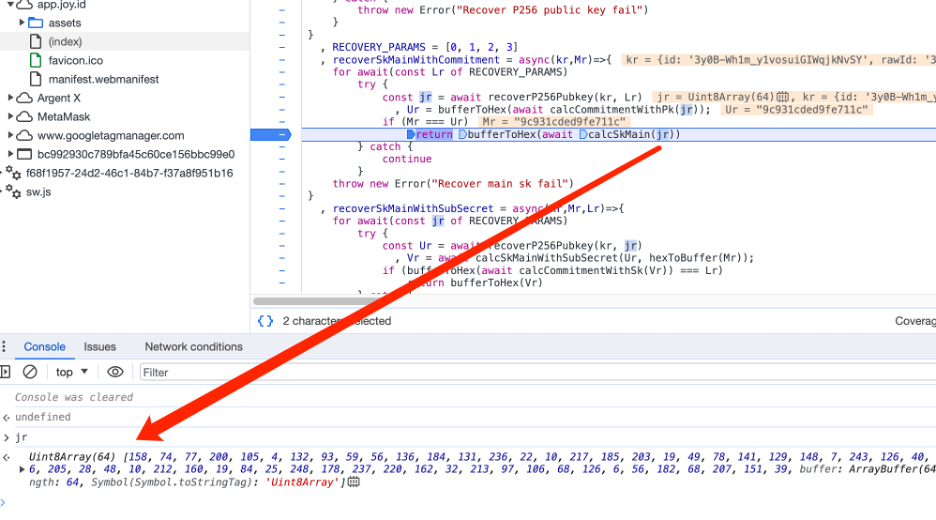
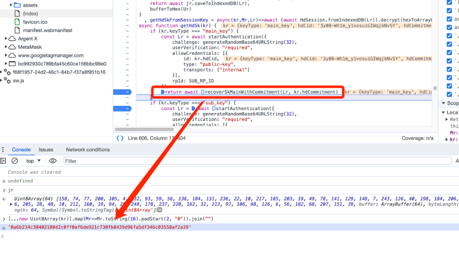
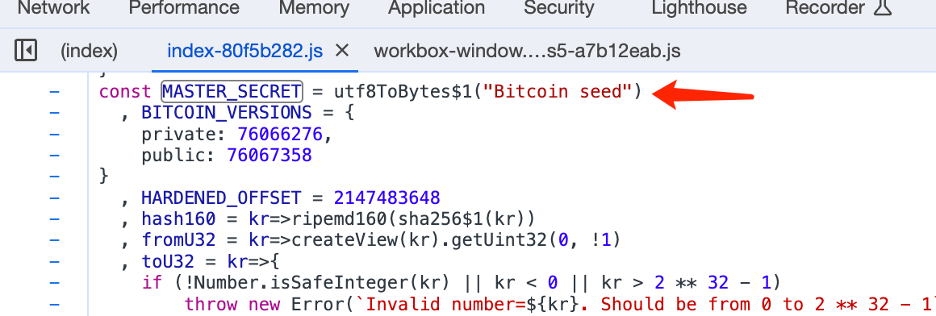
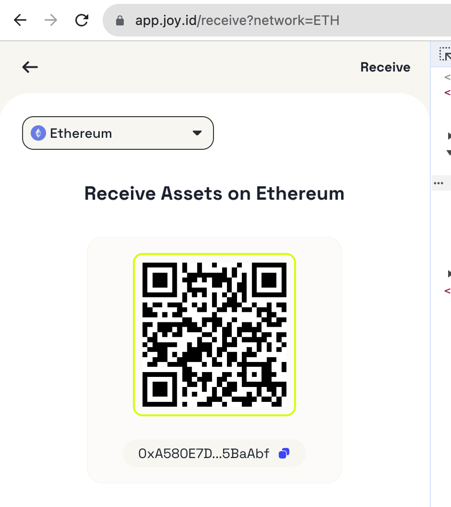

- Website
  - [app.joy.id](https://app.joy.id/)

- Risk
  - Unsecured use of passkey -- The public key of passkey may be used as the wallet private key
  
- Comment
  - joy.id uses passkey to sign the transaction, but the transaction is not actually signed through passkey. During the transaction signing process, joy.id recover passkey-p256 public key, and use the pubKey by signing it, and derives the user's private key by performing similar calculations:
      ```c
    PrivateKey = Hmac-sha512( sha256(pubKey || sha256(pubKey)), "Bitcoin seed")
    ```
  - from [@crypcipher(JoyID founder)](https://x.com/crypcipher/status/1722377779881316492?s=20):
  
    - ```
      Thank you for your research. Your research was partial right but the conclusion was wrong, the wallet security level is between hardware wallet and software wallet, there is no remote or simple approach to exploit. In passkey architecture, both the credential id and public key are not accessible to outside attackers without the user's authorisation. Let's say the widely used key derivation approach in Ethereum wallet by signing a specific message, dapp/user abstaining a secret key to encrypt their private data or assets. Signatures are 'insecure' and the ECDSA signatures shouldn't be the same when your sign twice to the same message in traditional algorithm convention. But they are reused in a nonconventional way and proved safe if the application level using them in the same nonconventional way too. We do use a secondary credential id and public key as part of the entropy to generate the signing key. It's not a standard usage i have to say. But the key still cannot be access by anyone else except the user. To exploit it, hacker has to control the front end website, and induce user complete the biometric authentication, which is almost as the same difficult as how to exploit a pure passkey protected system. I'm glad someone can help us to find simple potential attack approach (if any we will fix asap), and I'm also glad to talk more with you and your team about how to build a general protocol to bring passkey to the crypto world.
      ```


- Detail Step

  - Login:

    - Sign a random number

    - Xhr to https://api.joy.id/api/v1/credentials/$(credentialId)
      

    - Sign a random number again
      

    - Call function `recoverSkMainWithCommitment`
      

    - The public key `jr` recovered by `recoverP256Pubkey`

    - Call function `calcCommitmentWithPk`

      

    - Call function `calcSKMain`

      - `Mr = sha256(kr || sha256(kr)) ;` // kr = jr =  the public key of passkey

    - Call function `calcCommitmentWithSk`

      - `return sha256(Mr.slice(0,4)).slice(0,8);`

    - Compare the results of dhCommitment (from xhr result) and calcCommitmentWithSk() to check whether the recovered public key is correct.

      If correct then `calcSkMain(jr)` //   jr = the public key of passkey
      

    - The result:

     ```c
        Hex(sha256(jr|| sha256(jr))) = 0a6b234c38402100d2c0ff0af6de921c730fb0439d96fa5df346c03558af2a39
     ```
     

    - Derive private key
          
      
    - In the `generateEthAddress` function, `generateEthAccount` -&gt; `hdKeyToAccount(HDKey.fromMasterSeed(kr))`, kr = On
     
      

     
    
    - The fixed MASTER_SECRET data used, and the hash value `Mr` That relies on the passkey public key, and generates privateKey: jr via `Hmac-sha512`
    - Then call `hdKeyToAccount`  to derive private

     
     
     


-- -
   

Source file:https://app.joy.id/assets/index-80f5b282.js or [index-80f5b282.js.zip](source/index-80f5b282.js.zip)

